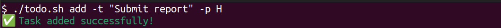
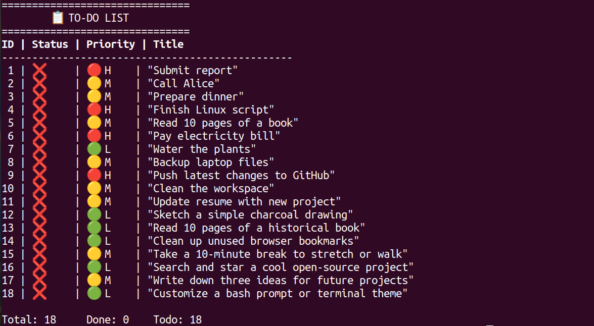
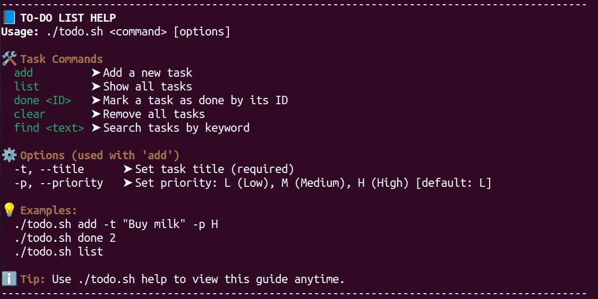
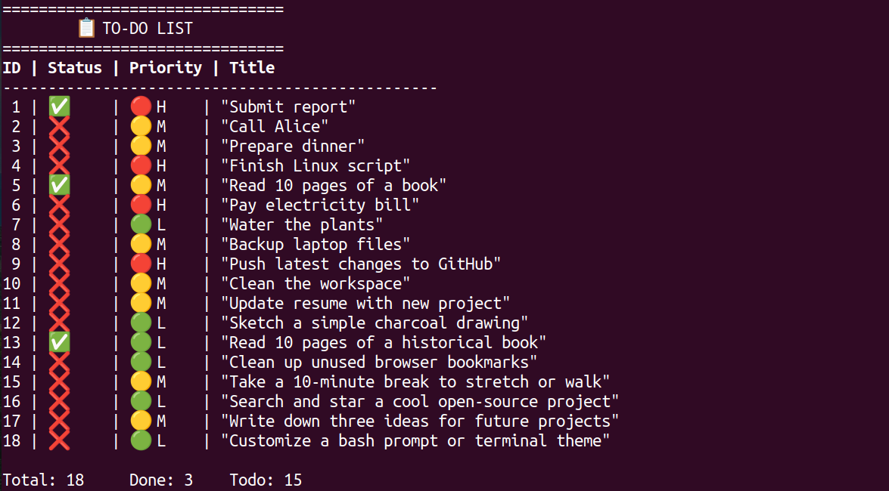

# To-Do list command line


## 📝 Discription


This is simple, colorful, and beginner-friendly command-line to-do list manager written in Bash. You can quickly add tasks, mark them as done, search through them, and export everything to a CSV file.

This tool is perfect for:

- Learning and practicing shell scripting
- Managing tasks from the terminal
- Keeping your personal or academic projects organized


 It uses a CSV file to store your tasks and
whether you're a terminal enthusiast, a Linux learner, or just want to build something minimal but useful, this script can help you practice scripting and build daily productivity habits.

## 📂 Table of contents
- [Installation](#installation)
- [Usage](#usage)
- [Features](#-features)
- [Screenshots](#-screenshots)
- []()
- []()
- []()
- []()
- []()
- [License](#license)


## 💾 Installation

Clone this repository:
```bash
git clone https://github.com/shiva-rsl/bash_script_ToDo_List.git 
cd bash_script_ToDo_List
```

Make the script executable:
```bash
chmod +x todo.sh
```

Then run the script:

```bash
./todo.sh help
```
## 🚀 Usage
To run the project, use the following command:

### ✅ Add a task

``` bash 
./todo.sh add 
```

### 📋 List all tasks
```
./todo.sh list
```

### ✅ Mark a task as done
```
./todo.sh done 5
```

### 🔍 Search tasks
```
./todo.sh find 15
```

### 🧹 Clear all tasks
```
./todo.sh clear
```

### 🆘 Help command
```
./todo.sh help
```


## ✨ Features

- ✅ Add tasks with priority (H/M/L)

- 📋 View all tasks in a formatted table

- 🔍 Search tasks by keyword

- ✅ Mark tasks as done

- 🧹 Clear all tasks

- 🆘 Helpful ```--help``` command


## 📸 Screenshots










## 🤝 Contributing
Pull requests are welcome. if you find a bug or want to suggest a feature, feel free to open an issue.

Please keep the code clean and follow the existing structure. 

## License

This project is licensed under the MIT License. Feel free to use, modify, and distribute.

For more information please view the [license description](https://choosealicense.com/licenses/mit/).