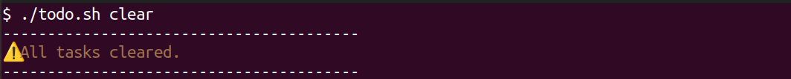

<h1 align="center">📝 To-Do List Command Line</h1>
<p align="center">
  
  
  
  
  
  
  
</p>


A **simple, colorful, and beginner-friendly** command-line to-do list manager written in Bash. Manage tasks, mark them as done, and save to CSV—all from your terminal!


## 📂 Table of contents
- [Discription](#discription)
- [Features](#-features)
- [Installation](#installation)
- [Usage](#usage)
- [Screenshots](#-screenshots)
- [License](#license)


## 📝 Discription

This Bash script helps you organize tasks with a minimalist CLI interface. Perfect for:

- **Terminal enthusiasts** who prefer keyboard over GUIs
- **Linux learners** practicing shell scripting
- **Developers** needing quick task tracking


Tasks are stored in `tasks.csv`, and the script supports priorities (High/Medium/Low), search, and cleanup.


## ✨ Features

- ✅ Add tasks with priority (H/M/L)

- 📋 View all tasks in a formatted table

- 🔍 Search tasks by keyword

- ✅ Mark tasks as done

- 🗑️ Clear all tasks

- 🆘 Helpful ```--help``` command


## 💾 Installation

#### Clone this repository:
```bash
git clone https://github.com/shiva-rsl/bash_script_ToDo_List.git 
```

#### Navigate to project directory:
```
cd bash_script_ToDo_List
```

#### Make the script executable:
```bash
chmod +x todo.sh
```

#### Run help to verify installation:

```bash
./todo.sh help
```


## 🚀 Usage
To run the project, use the following command:

### ✅ Add a task with high priority

``` bash 
./todo.sh add -t "pay elecricity bill" -p H
```

### 📋 List all tasks
```
./todo.sh list
```

### ✅ Mark a task as done
```
./todo.sh done 5
```

### 🔍 Search tasks
```
./todo.sh find 15
```

### 🗑️ Clear all tasks
```
./todo.sh clear
```

### 🆘 Help command
```
./todo.sh help
```


## 📸 Screenshots

Here’s a visual tour of how the To-Do List CLI app works:

#### ➕ Add a task

Easily add tasks with priority using the `add` command:


--- 

### 📋 List All Tasks
View your tasks in a neatly formatted table:


---

### ✅ Mark Task as Done
Mark any task as completed by its ID:


---

### 🔍 Find Tasks by task ID
Quickly locate a task using the `find` command:


---

### 🗂️ Completed Tasks in List
View a list showing done vs pending tasks:


---

### 🆘 Help Command Output
Built-in help menu with usage examples:


---

### 🗑️ Clear All Tasks
Remove all saved tasks instantly:



---

### ⚠️ Example Errors

The script handles incorrect usage gracefully:

**Missing Title**


---

**Invalid Priority Value**


---

**Missing ID**


---


## License

This project is licensed under the MIT License. Feel free to use, modify, and distribute.

For more information please view the [license description](https://choosealicense.com/licenses/mit/).

